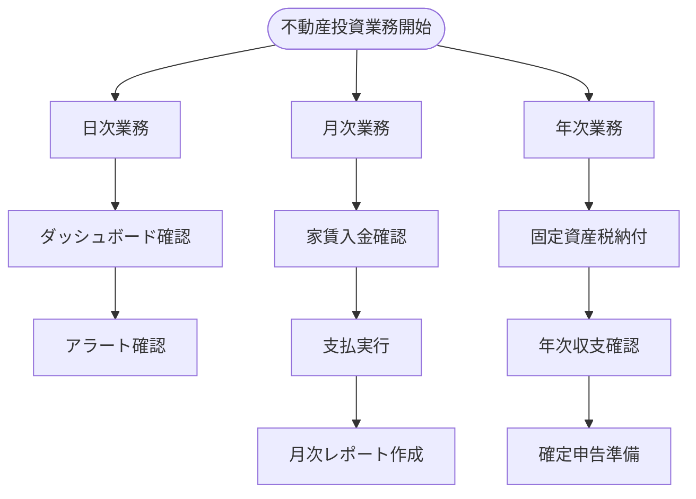
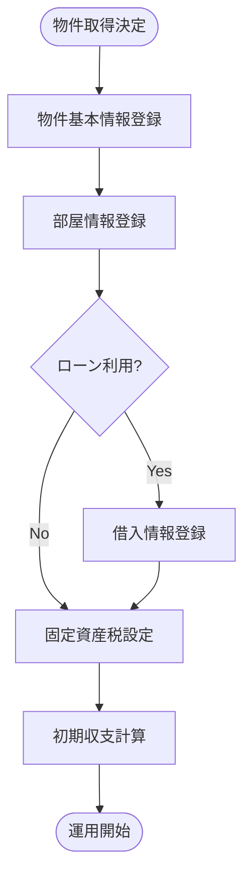
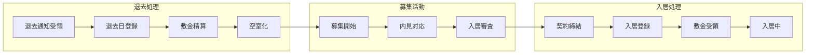
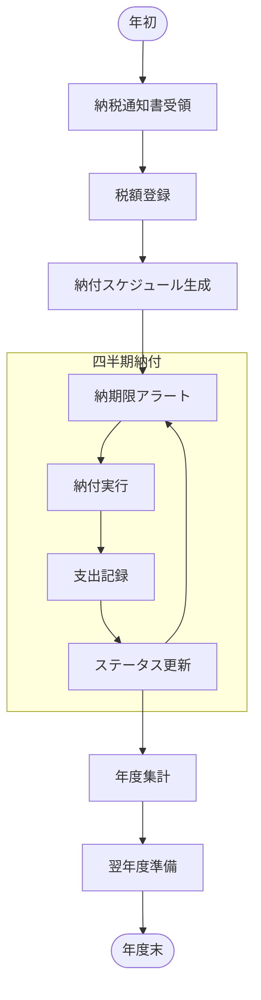
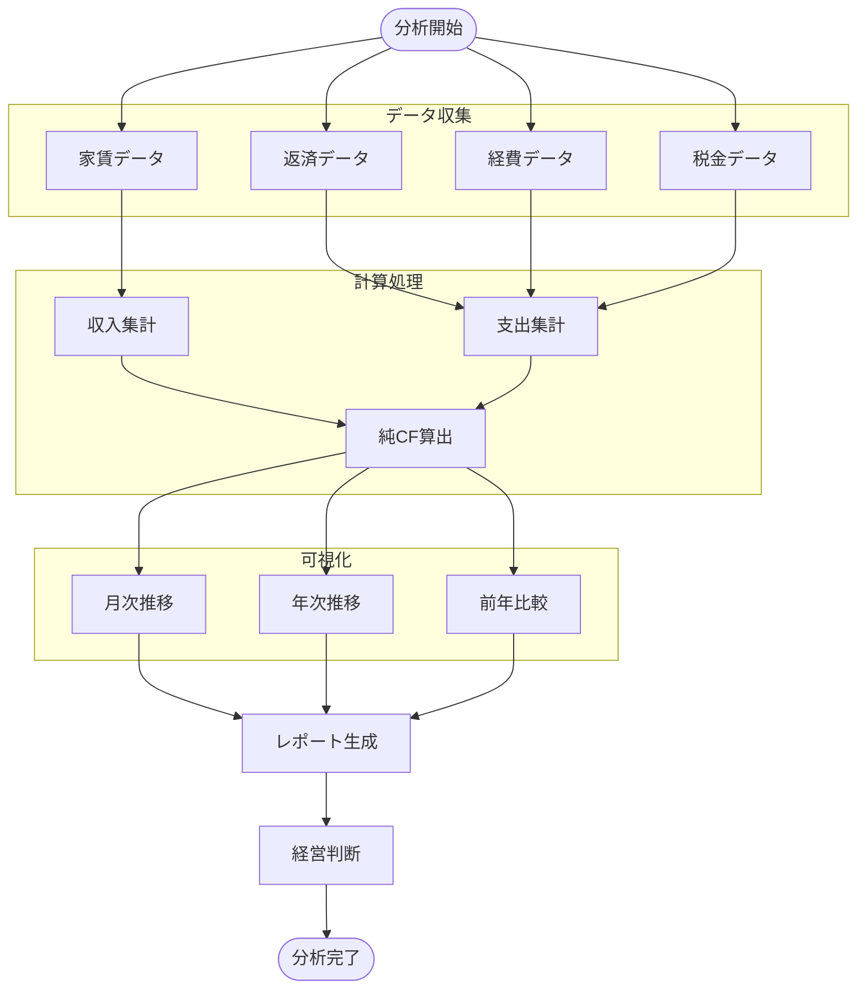
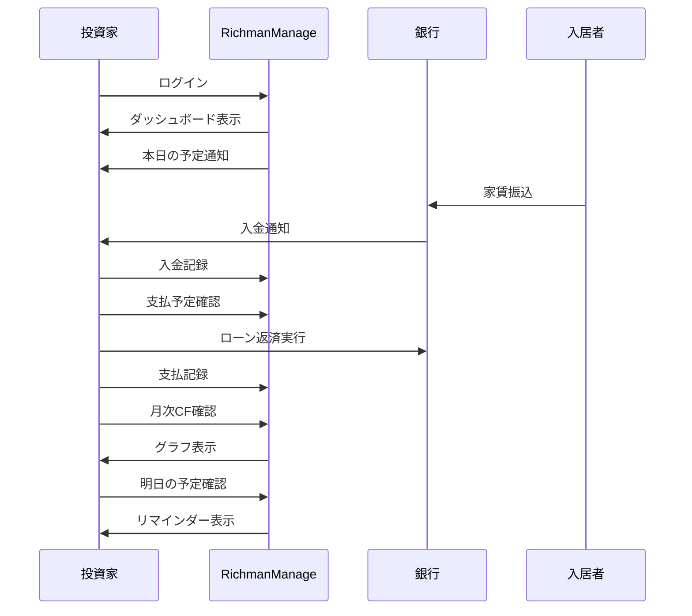
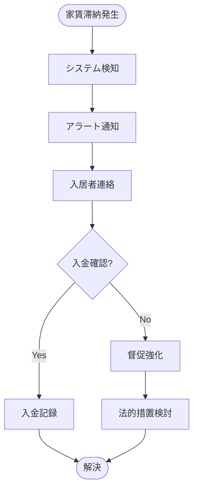
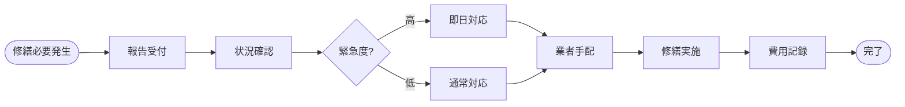
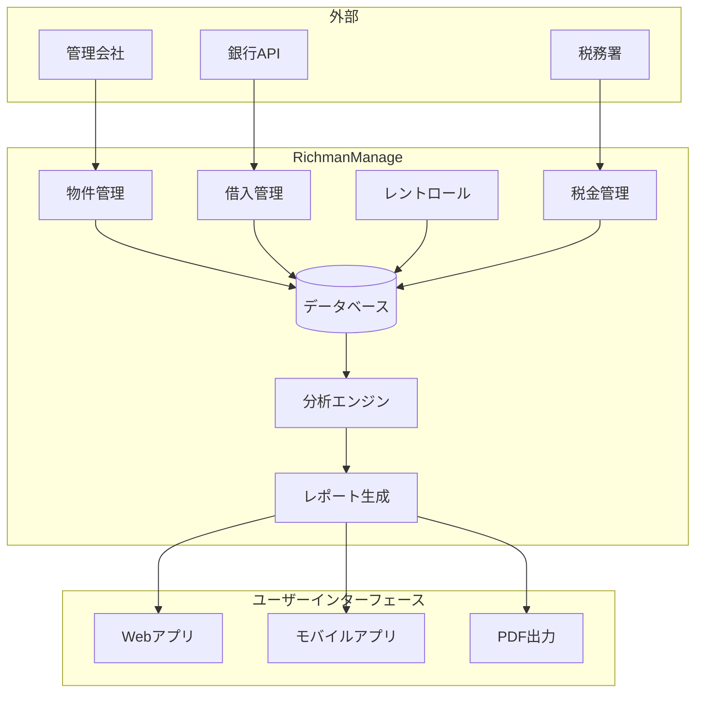

# 業務フロー図 - RichmanManage

## 1. 全体業務フロー

## 2. 月次業務フロー詳細

```mermaid
graph LR
    Start([月初])
    
    %% 収入確認フェーズ
    subgraph 収入確認
        CheckRent[レントロール確認]
        UpdateStatus[入居状況更新]
        RecordIncome[入金記録]
    end
    
    %% 支出処理フェーズ
    subgraph 支出処理
        LoanPayment[ローン返済]
        ExpenseInput[経費入力]
        TaxReserve[税金積立]
    end
    
    %% レポート作成フェーズ
    subgraph レポート作成
        CalcCF[CF計算]
        CreatePDF[PDF生成]
        BankSubmit[銀行提出]
    end
    
    End([月末])
    
    %% フロー
    Start --> CheckRent
    CheckRent --> UpdateStatus
    UpdateStatus --> RecordIncome
    RecordIncome --> LoanPayment
    LoanPayment --> ExpenseInput
    ExpenseInput --> TaxReserve
    TaxReserve --> CalcCF
    CalcCF --> CreatePDF
    CreatePDF --> BankSubmit
    BankSubmit --> End
```

## 3. 物件取得フロー

## 4. 入退去管理フロー

## 5. 固定資産税管理フロー

## 6. キャッシュフロー分析フロー

## 7. システム利用の典型的な1日

## 8. 例外処理フロー

### 8.1 家賃滞納対応

### 8.2 緊急修繕対応

## 9. データフロー図

## 10. 年間業務カレンダー

| 月 | 定期業務 | イベント |
|----|----------|----------|
| 1月 | 月次収支確認 | 年間計画策定 |
| 2月 | 月次収支確認 | 固定資産税4期納付、確定申告準備 |
| 3月 | 月次収支確認 | 確定申告、契約更新確認 |
| 4月 | 月次収支確認 | 新年度開始 |
| 5月 | 月次収支確認 | 固定資産税通知受領 |
| 6月 | 月次収支確認 | 固定資産税1期納付 |
| 7月 | 月次収支確認 | 上期実績確認 |
| 8月 | 月次収支確認 | 修繕計画検討 |
| 9月 | 月次収支確認 | 固定資産税2期納付、契約更新確認 |
| 10月 | 月次収支確認 | 年末調整準備 |
| 11月 | 月次収支確認 | 翌年度予算策定 |
| 12月 | 月次収支確認 | 固定資産税3期納付、年間実績確認 |

