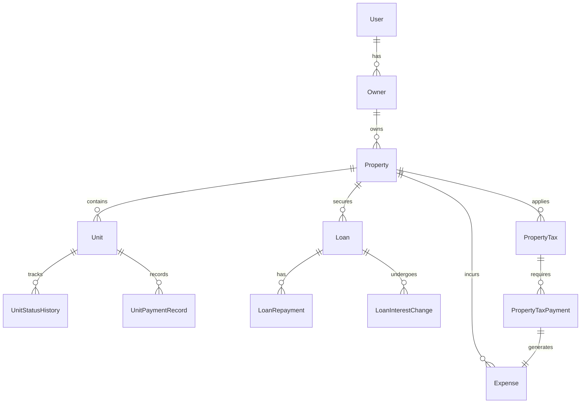
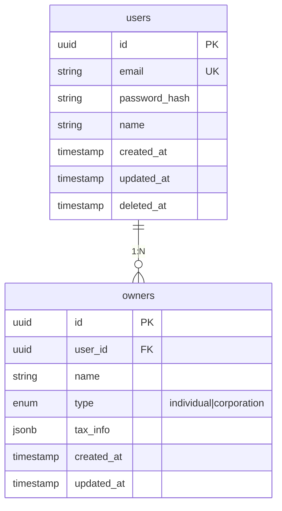
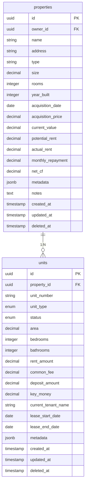
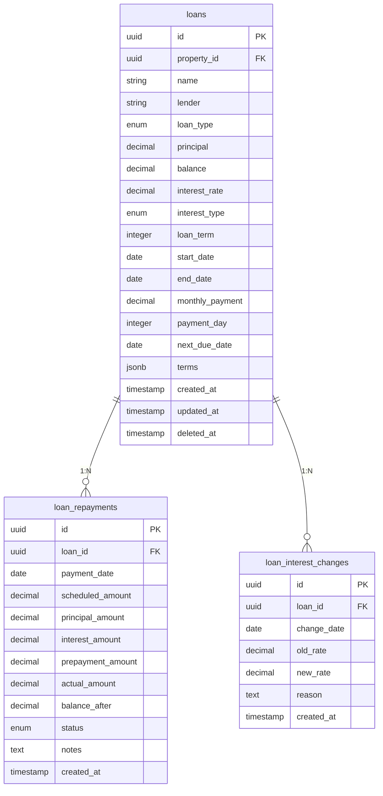
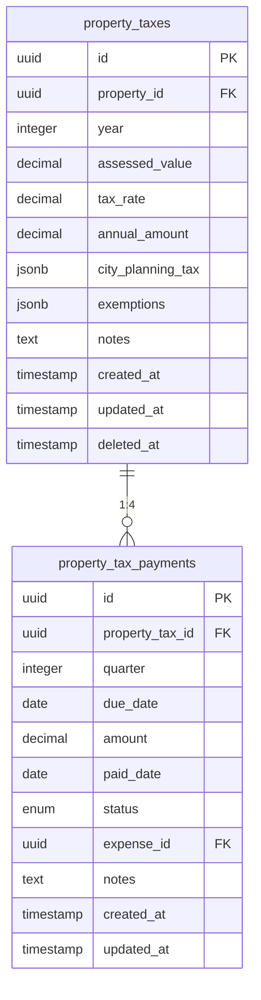
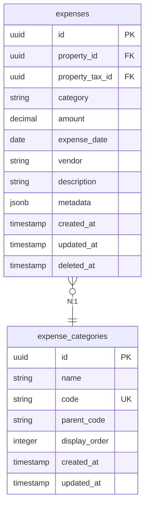

# データモデル図 - RichmanManage

## 1. 概念データモデル



## 2. 論理データモデル詳細

### 2.1 ユーザー・所有者関連



### 2.2 物件関連



### 2.3 借入関連



### 2.4 固定資産税関連



### 2.5 支出関連



## 3. 主要エンティティ関係

### 3.1 物件中心の関係性

```
            ┌─────────┐
            │ Property │
            └────┬────┘
                 │
    ┌────────────┼────────────┬──────────────┐
    ▼            ▼            ▼              ▼
┌──────┐    ┌──────┐    ┌────────┐    ┌─────────┐
│ Unit │    │ Loan │    │ Tax    │    │ Expense │
└──────┘    └──────┘    └────────┘    └─────────┘
```

### 3.2 時系列データの扱い

```
Unit Status History:
[入居] → [退去] → [空室] → [入居] → [現在]
  ↓        ↓        ↓        ↓
記録      記録      記録     記録

Loan Interest Changes:
[初期金利] → [変更1] → [変更2] → [現在]
   ↓          ↓         ↓
 記録        記録       記録
```

## 4. データ集計ビュー

### 4.1 物件収支サマリービュー

```sql
CREATE VIEW property_summary AS
SELECT 
    p.id,
    p.name,
    p.owner_id,
    -- 収入
    COALESCE(SUM(u.rent_amount + u.common_fee), 0) as potential_rent,
    COALESCE(SUM(
        CASE WHEN u.status = 'occupied' 
        THEN u.rent_amount + u.common_fee 
        ELSE 0 END
    ), 0) as actual_rent,
    -- 支出
    COALESCE(SUM(l.monthly_payment), 0) as monthly_repayment,
    -- キャッシュフロー
    (actual_rent - monthly_repayment) as net_cf
FROM properties p
LEFT JOIN units u ON p.id = u.property_id
LEFT JOIN loans l ON p.id = l.property_id
GROUP BY p.id;
```

### 4.2 入居率統計ビュー

```sql
CREATE VIEW occupancy_stats AS
SELECT 
    p.id as property_id,
    p.name as property_name,
    COUNT(u.id) as total_units,
    COUNT(CASE WHEN u.status = 'occupied' THEN 1 END) as occupied_units,
    COUNT(CASE WHEN u.status = 'vacant' THEN 1 END) as vacant_units,
    ROUND(
        COUNT(CASE WHEN u.status = 'occupied' THEN 1 END)::numeric / 
        COUNT(u.id) * 100, 
        1
    ) as occupancy_rate
FROM properties p
JOIN units u ON p.id = u.property_id
GROUP BY p.id, p.name;
```

## 5. インデックス戦略

### 5.1 主要インデックス

```sql
-- 外部キーインデックス
CREATE INDEX idx_properties_owner_id ON properties(owner_id);
CREATE INDEX idx_units_property_id ON units(property_id);
CREATE INDEX idx_loans_property_id ON loans(property_id);
CREATE INDEX idx_expenses_property_id ON expenses(property_id);

-- 検索用インデックス
CREATE INDEX idx_units_status ON units(status);
CREATE INDEX idx_expenses_expense_date ON expenses(expense_date);
CREATE INDEX idx_property_taxes_year ON property_taxes(year);

-- 複合インデックス
CREATE INDEX idx_units_property_status ON units(property_id, status);
CREATE INDEX idx_expenses_property_date ON expenses(property_id, expense_date);
```

## 6. データ整合性制約

### 6.1 ビジネスルール制約

```sql
-- 金額の妥当性
ALTER TABLE properties 
ADD CONSTRAINT chk_rent_positive 
CHECK (potential_rent >= 0 AND actual_rent >= 0);

-- 日付の整合性
ALTER TABLE units 
ADD CONSTRAINT chk_lease_dates 
CHECK (lease_start_date < lease_end_date);

-- ステータスの整合性
ALTER TABLE property_tax_payments 
ADD CONSTRAINT chk_payment_status 
CHECK (
    (status = 'paid' AND paid_date IS NOT NULL) OR
    (status IN ('pending', 'overdue') AND paid_date IS NULL)
);
```

### 6.2 トリガー

```sql
-- 物件収支自動更新トリガー
CREATE OR REPLACE FUNCTION update_property_financials()
RETURNS TRIGGER AS $$
BEGIN
    -- 物件の収支情報を再計算
    UPDATE properties SET
        actual_rent = (
            SELECT COALESCE(SUM(rent_amount + common_fee), 0)
            FROM units
            WHERE property_id = NEW.property_id
            AND status = 'occupied'
        ),
        updated_at = NOW()
    WHERE id = NEW.property_id;
    
    RETURN NEW;
END;
$$ LANGUAGE plpgsql;

CREATE TRIGGER trigger_update_property_on_unit_change
AFTER INSERT OR UPDATE OR DELETE ON units
FOR EACH ROW
EXECUTE FUNCTION update_property_financials();
```

## 7. パーティショニング戦略

### 7.1 時系列データのパーティショニング

```sql
-- 支出テーブルの月次パーティショニング
CREATE TABLE expenses_2024_01 PARTITION OF expenses
FOR VALUES FROM ('2024-01-01') TO ('2024-02-01');

CREATE TABLE expenses_2024_02 PARTITION OF expenses
FOR VALUES FROM ('2024-02-01') TO ('2024-03-01');

-- 自動パーティション作成
CREATE OR REPLACE FUNCTION create_monthly_partition()
RETURNS void AS $$
DECLARE
    start_date date;
    end_date date;
    partition_name text;
BEGIN
    start_date := date_trunc('month', CURRENT_DATE);
    end_date := start_date + interval '1 month';
    partition_name := 'expenses_' || to_char(start_date, 'YYYY_MM');
    
    EXECUTE format(
        'CREATE TABLE IF NOT EXISTS %I PARTITION OF expenses
        FOR VALUES FROM (%L) TO (%L)',
        partition_name, start_date, end_date
    );
END;
$$ LANGUAGE plpgsql;
```

## 8. バックアップ・リカバリ設計

### 8.1 バックアップ対象

| データ種別 | バックアップ頻度 | 保持期間 |
|------------|------------------|----------|
| トランザクションデータ | 毎時 | 7日間 |
| マスタデータ | 日次 | 30日間 |
| 設定データ | 変更時 | 永久 |
| ログデータ | 日次 | 90日間 |

### 8.2 Point-in-Time Recovery

```sql
-- WAL設定
wal_level = replica
archive_mode = on
archive_command = 'cp %p /backup/archive/%f'

-- ベースバックアップ
pg_basebackup -D /backup/base -Ft -z -P
```

## 9. データ移行戦略

### 9.1 初期データ投入

```sql
-- CSVからの一括投入
COPY properties (name, address, type, owner_id) 
FROM '/data/properties.csv' 
WITH CSV HEADER;

-- 既存システムからの移行
INSERT INTO properties (id, name, address, ...)
SELECT 
    gen_random_uuid(),
    property_name,
    property_address,
    ...
FROM legacy_properties;
```

## 10. 監視・メンテナンス

### 10.1 定期メンテナンスタスク

```sql
-- 統計情報更新
ANALYZE properties;
ANALYZE units;

-- インデックス再構築
REINDEX INDEX idx_units_property_status;

-- 肥大化解消
VACUUM FULL expenses;
```

### 10.2 パフォーマンス監視

```sql
-- スロークエリ監視
SELECT 
    query,
    calls,
    total_time,
    mean_time,
    max_time
FROM pg_stat_statements
WHERE mean_time > 1000  -- 1秒以上
ORDER BY mean_time DESC;
```

---
最終更新: 2024-12-16